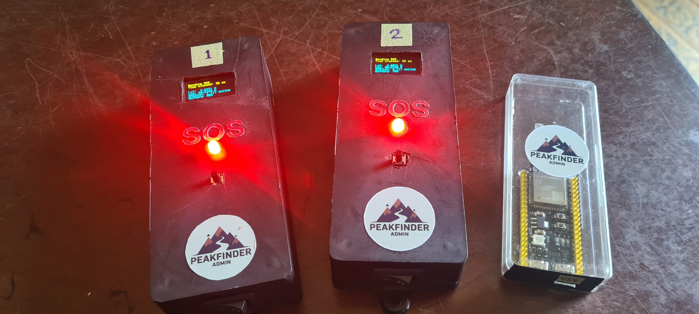
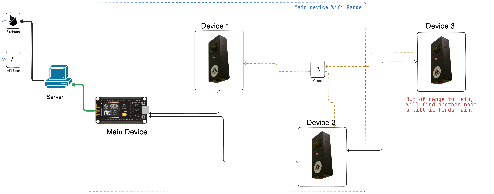

<h1 align="center">
  <br>
  <a href="http://www.amitmerchant.com/electron-markdownify"></a>
  <br>
  hiking emergency stations
  <br>
</h1>


<p align="center">
  <a href="https://badge.fury.io/js/electron-markdownify">
    
  </a>
  <a href="https://gitter.im/amitmerchant1990/electron-markdownify"></a>
  <a href="https://saythanks.io/to/bullredeyes@gmail.com">
      
  </a>
  <a href="https://www.paypal.me/AmitMerchant">
    
  </a>
</p>

<p align="center">
  <a href="#key-features">Key Features</a> •
  <a href="#overview">Overview</a> •
  <a href="#how-to-use">How To Use</a> •
  <a href="#download">Download</a> •
  <a href="#credits">Credits</a> •
  <a href="#references">References</a> •
  <a href="#license">License</a>
</p>



<!-- ## Key Features

* LivePreview - Make changes, See changes
  - Instantly see what your Markdown documents look like in HTML as you create them.
* Sync Scrolling
  - While you type, LivePreview will automatically scroll to the current location you're editing.
* GitHub Flavored Markdown  
* Syntax highlighting
* [KaTeX](https://khan.github.io/KaTeX/) Support
* Dark/Light mode
* Toolbar for basic Markdown formatting
* Supports multiple cursors
* Save the Markdown preview as PDF
* Emoji support in preview :tada:
* App will keep alive in tray for quick usage
* Full screen mode
  - Write distraction free.
* Cross platform
  - Windows, macOS and Linux ready.

--- -->

## Overview

### Scenario

### Architecture

True ad-hoc networking
painlessMesh is a true ad-hoc network, meaning that no-planning, central controller, or router is required. Any system of 1 or more nodes will self-organize into fully functional mesh. The maximum size of the mesh is limited (we think) by the amount of memory in the heap that can be allocated to the sub-connections buffer and so should be really quite high.

[esp8266-mesh-network](https://randomnerdtutorials.com/esp-mesh-esp32-esp8266-painlessmesh/) - ESP-MESH Network Architecture
[painlessMesh Library](https://gitlab.com/painlessMesh/painlessMesh) - More information about the painlessMesh library


#### Schematic


---

## Download

+ [Arduino IDE](https://downloads.arduino.cc/arduino-ide/arduino-ide_2.3.3_Windows_64bit.exe) for Windows.
+ [Python](https://www.python.org/downloads/) 3.xx (used 3.12)
+ 


## How To Use

To clone and run this application, you'll need [Git](https://git-scm.com) and [Python](https://www.python.org/downloads/) installed on your computer.

> **Note**
> Remember to place your `firebase-admin-auth.json` file in the root rirectory.


> From your command line

Python libraries used.
```cmd
firebase_admin==6.5.0
Flask==3.1.0
pyserial==3.5
Requests==2.32.3
rich==13.9.4
```
Generate exe file. 
```cmd
pyinstaller --onefile run.py
```
Output exe to `/dist/run.exe` Move the exe to root directory.

Run the file 
`run.exe` or `python run.py`


---


## References

[esp8266-painlessmesh](https://randomnerdtutorials.com/esp-mesh-esp32-esp8266-painlessmesh/) - ESP-MESH Network Architecture
[painlessMesh Library](https://gitlab.com/painlessMesh/painlessMesh) - More information about the painlessMesh library


## License

MIT


